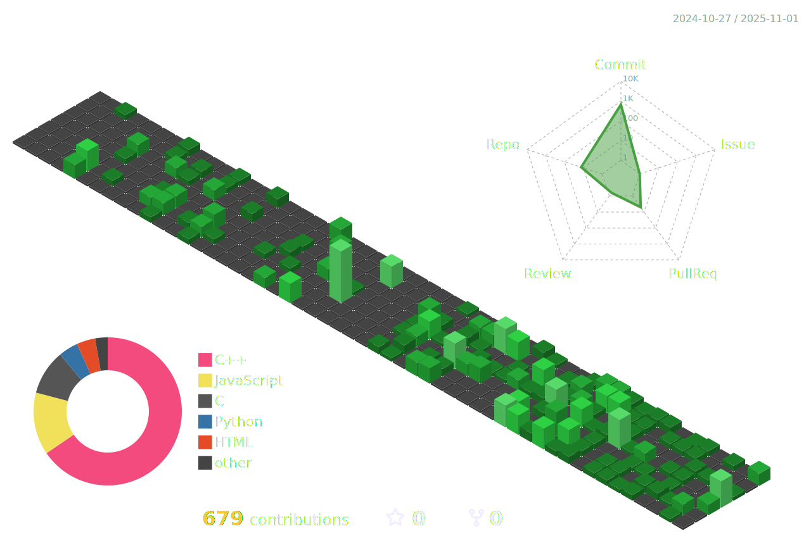

<h1 align="left">Hi 👋! My name is Adarsh Jha</h1>

###

<p align="left">🎓 I am currently a student at the National Institute of Technology, Raipur.<br>💡 I have a strong interest in exploring new technologies and leveraging them to develop efficient and impactful solutions.</p>

###

<div align="center">
  
  
</div>


###

### 🛠️ Tech Stack

<div align="left" >
  
  

  
  

  
  

  
  

  
  

  
  

  
  

  
  

  
  

  
  

  
  

  
  

</div>

###

<p align="left">You can also connect with me directly via <strong>npx</strong>.</p>
<p align="left">Just hit this command in terminal 👇</p>

```bash
npx hacketthadwin
```

<div style="margin: 20px 0; display: flex; flex-direction: column; align-items: flex-start; gap: 8px;">
  <a href="mailto:adarsh12345678jha@gmail.com" target="_blank">
    
  </a>
  <a href="https://www.linkedin.com/in/hacketthadwin" target="_blank">
    
  </a>
  <a href="https://adarshjha.vercel.app/" target="_blank">
    
  </a>
</div>


###

<br clear="both">




###

<div align="center">
<!--    -->
</div>

###
